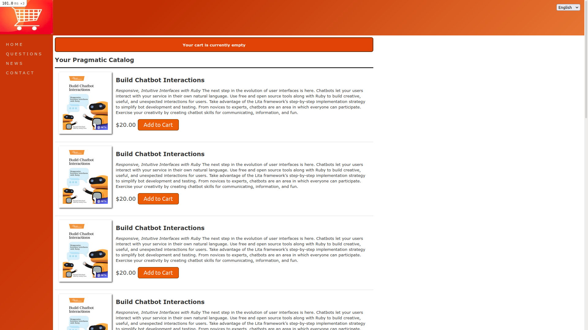

# Zapcart

> Zapcart is a shopping cart built from scratch with ruby on rails and some react js on the front end, the app basically allows sellers to post their products and users will buy the products and choose the payment method

## Built With

- Ruby On Rails
- PostgeSQL
- JavaScript
- React
- html 
- css
- Tailwind
- Lots of love :heart:

## Live Demo

[Zapcart Live Demo](https://zapcart.herokuapp.com/)

👤 **Shaher Shamroukh**
 
[<code></code>](https://github.com/Shaher-11)
[<code></code>](https://twitter.com/ShaherShamroukh/)
[<code></code>](https://www.linkedin.com/in/shaher-shamroukh/)
 
 

## 🤝 Contributing

Contributions, issues, and feature requests are welcome!

Feel free to check the [issues page](https://github.com/Shaher-11/udzilla/issues).

## Show your support

Give a ⭐️ if you like this project!

## 📝 License

This project is [MIT](../LICENSE) licensed.
